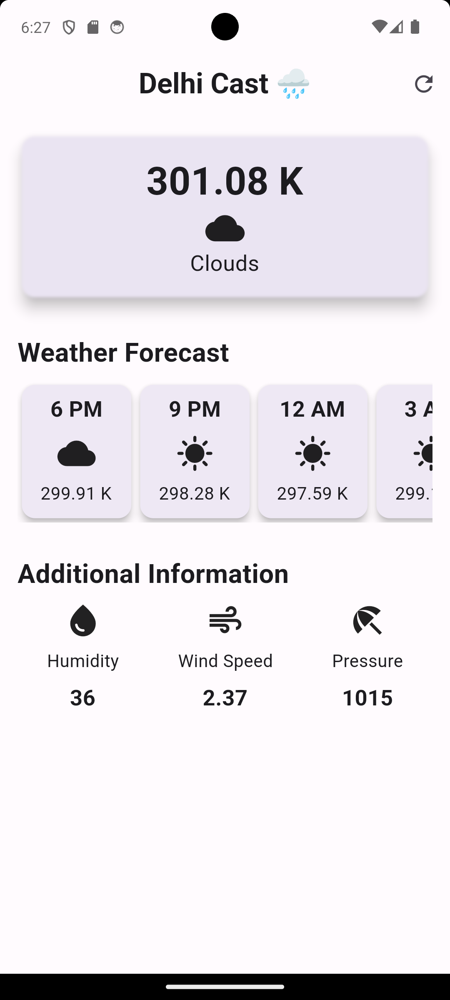
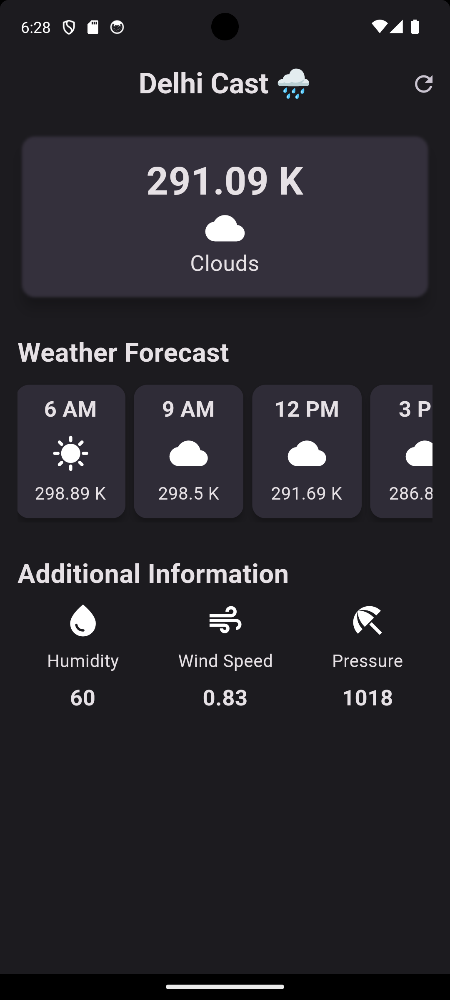

# Delhi Cast 
A real-time weather application for Delhi, developed using Flutter. This app provides up-to-date weather information by leveraging the OpenWeatherMap API.

## App Preview

## Features

- Real-time weather data for Delhi.
- Displays temperature, air Pressure, humidity and wind speed for the next **24 hours**.
- Material Design for an intuitive user interface.
- Updates data to the latest weather on every refresh.
- Responsive and dynamic design for various screen sizes.

## Technologies Used

- **Flutter:** The framework for building the app's user interface and logic.
- **Dart:** The programming language used with Flutter.
- **OpenWeatherMap API:** The source of real-time weather data.
- **Visual Studio Code:** The code editor used for development.
- **Android Studio:** The emulator used for testing(Google Pixel 6A).

## Contributing

To contribute to the project, 
- Contribute for the **cupertino design**.
- Please open an issue first to discuss your proposed changes.

### Prerequisites

- Install [Flutter](https://flutter.dev/docs/get-started/install) on your development machine.
- Sign up for an API key at [OpenWeatherMap](https://openweathermap.org/api) and replace `YOUR_API_KEY` in `lib/services/weather_service.dart` with your API key.

## Author

By Karan Upadhyay
